# miniMP3
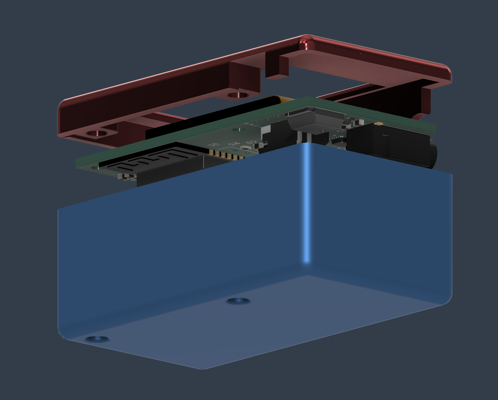
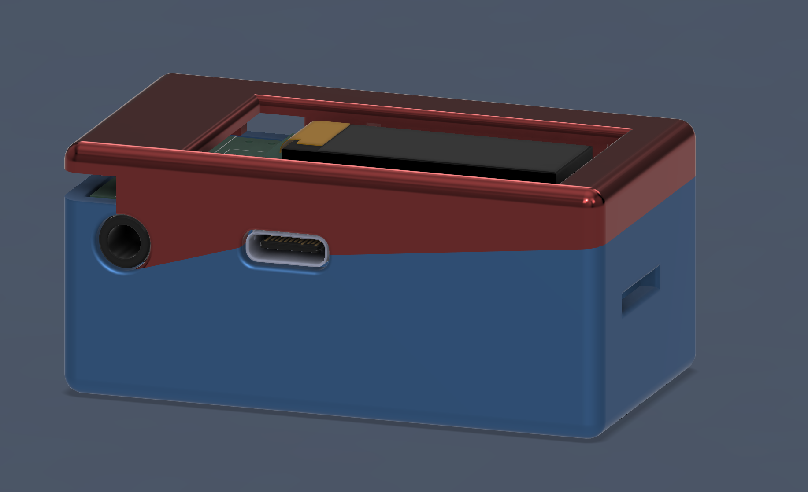

## About
A compact music player. 59.3 x 32 x 27 (mm). Bluetooth and 3.5mm jack compatible. mp3, wav, and flac compatible. 5-band EQ, and more functions when the firmware updates. 

## Idea
I wanted a little mp3 player that was small enough that I could just toss into my shirt pocket or keep it on a necklace. I don't want to be tied so much to my phone, and this seems like a reasonable first step to move a function off. There are also a couple old cds and etc. that I'd like to download.

## Assembly
Solder on:
- the display module
- the SD card module
- the boot switch (4x4 push switch)
- the power switch (toggle switch)
- the rotary switches

Insert the heat-sets into the two slots above and below. 

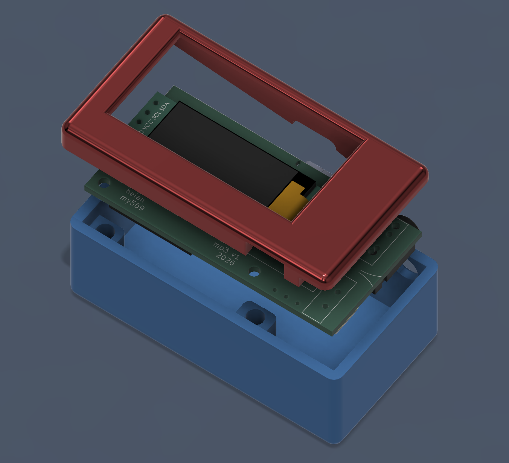

Fasten in the M2 screw on the bottom. 
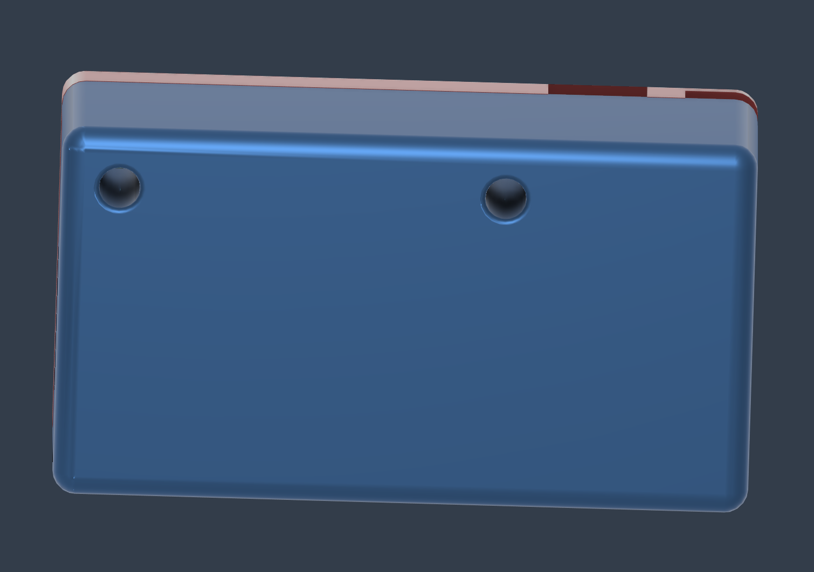

## PCB
### Layer 1
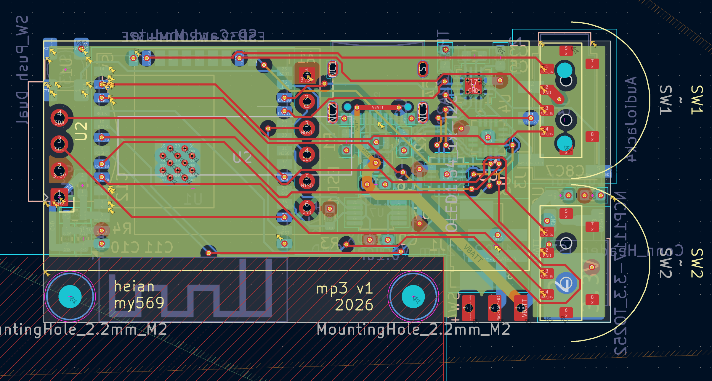
### Layer 2
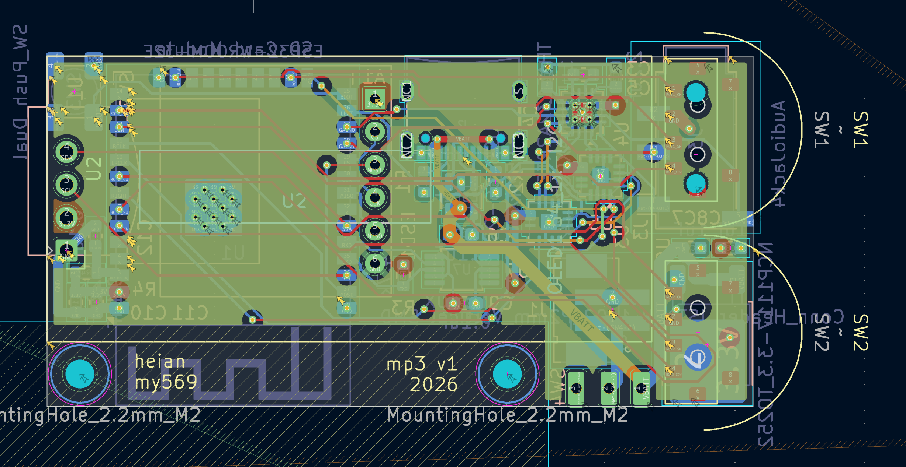
### Layer 3
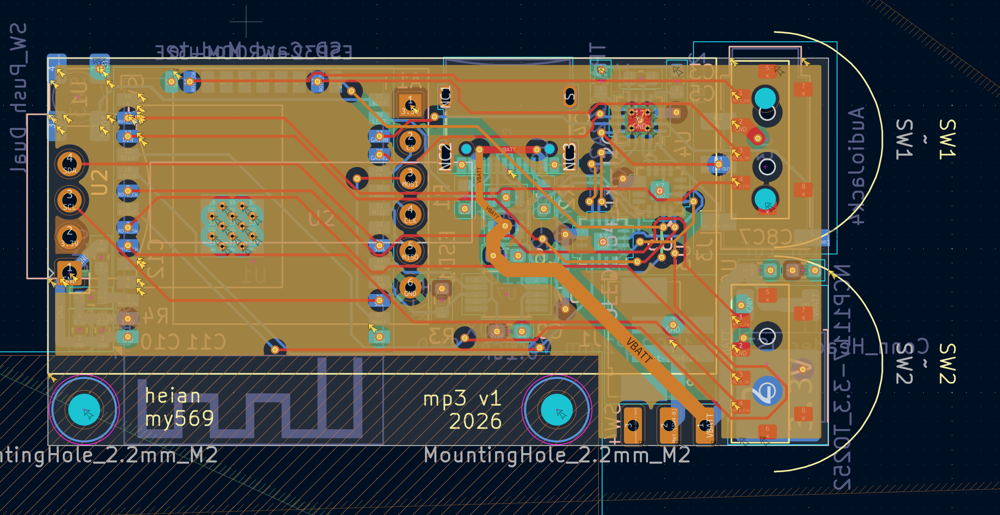
### Layer 4
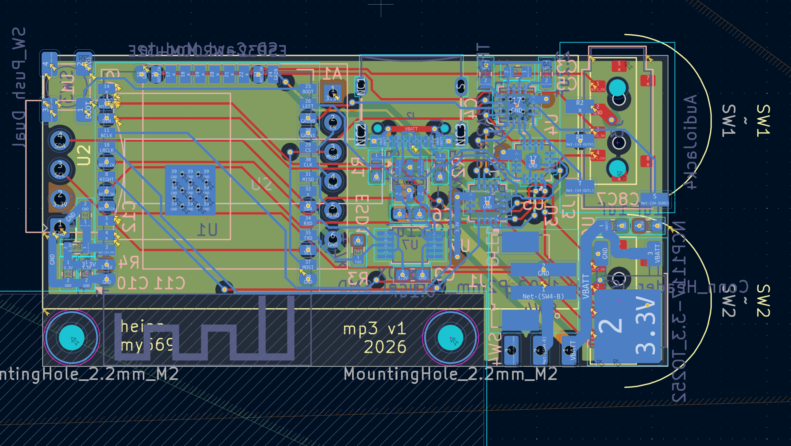
### 3D Model Front
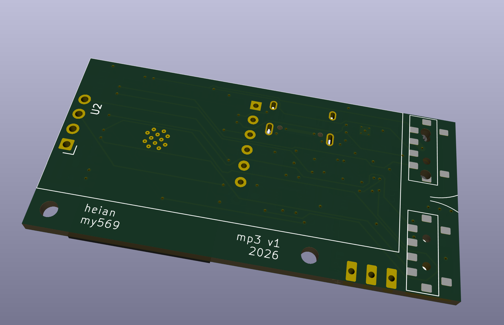
### 3D Model Back
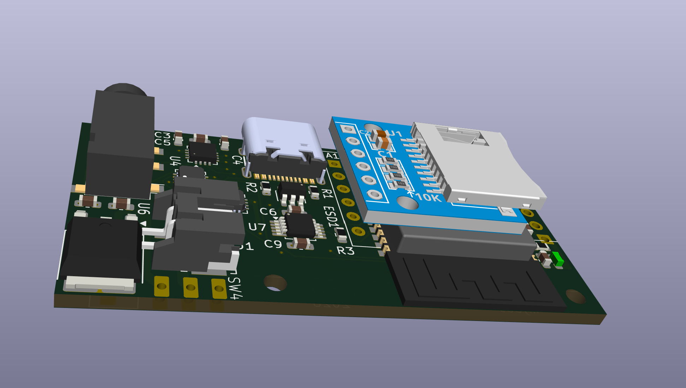
## Schematic
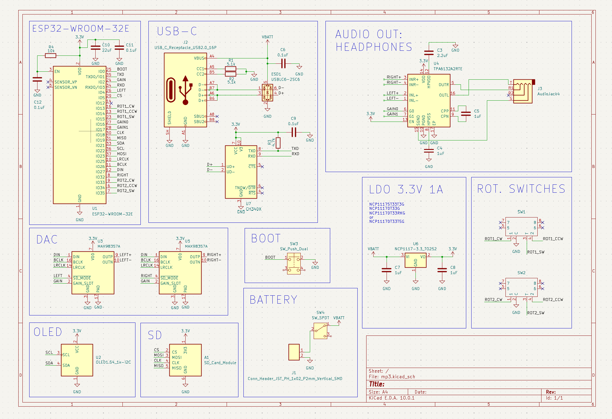 
## CAD

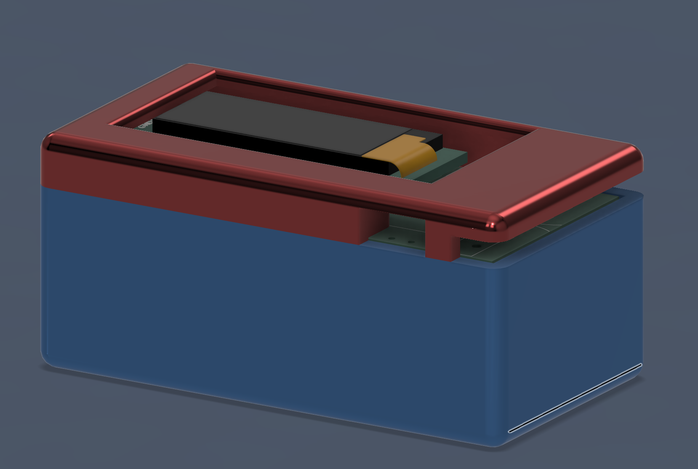

## BOM  
- 1x PCB 
- 1x SD Card Module
- 1x 1.54" OLED Display Module
- 1x PJ320-D Jack
- 1x 4mmx4mm Push Switch
- 1x Sliding Power Switch